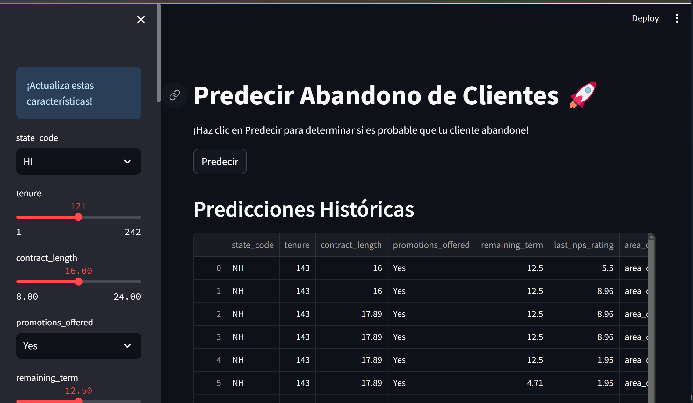
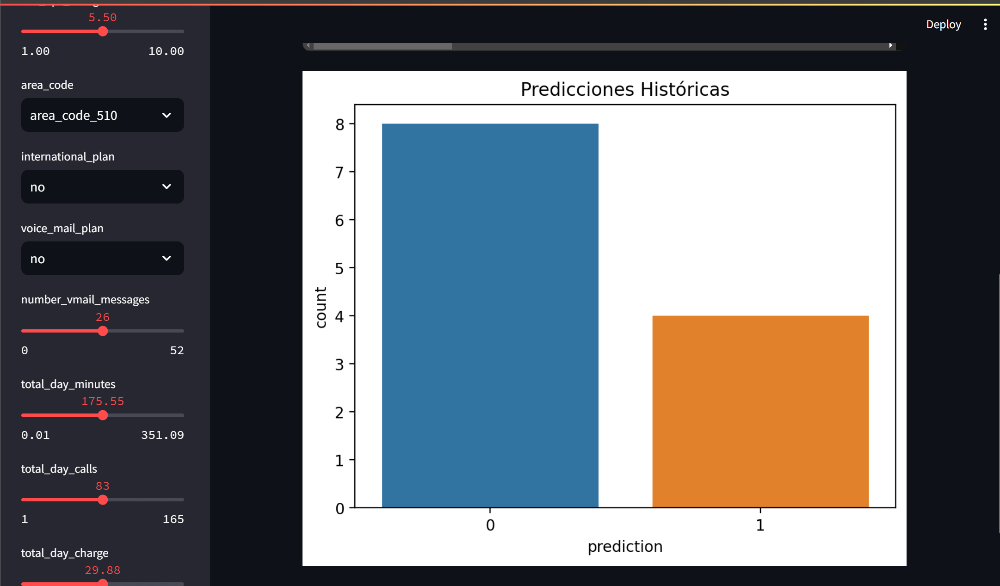

# Predict Customer Churn with Streamlit 🚀

This application uses Machine Learning to predict whether a customer will leave a service (_churn_). The app is developed with Python and Streamlit, providing an interactive and user-friendly interface to make predictions based on provided data.

## Usage

#### 1. Enter Customer Features

Use the sidebar to input customer data.

#### 2. Make a Prediction

Click the "Predict" button to get the result.

#### 3. View Historical Results

Check the "Historical Predictions" section to analyze past predictions.

## Project Structure

`app.py`: Main code for the Streamlit application.

`utils.py`: Helper functions, including data transformation.

`data/`: Contains necessary data files such as `schema.json` and `historical_data.csv`.

`models/`: Contains pretrained models (`xg.pkl` and `encoder.pkl`).

`requirements.txt`: List of dependencies required to run the application.

## Contributions

Contributions are welcome. If you have ideas to improve this application, please open an issue or create a pull request.

## License

This project is licensed under the MIT License. See the `LICENSE` file for more details.
