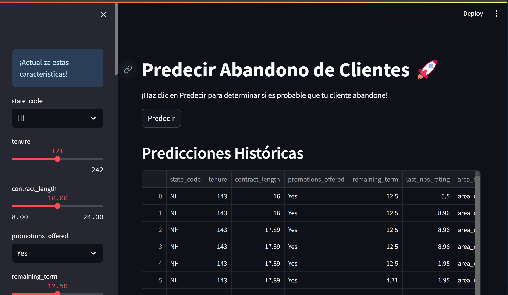
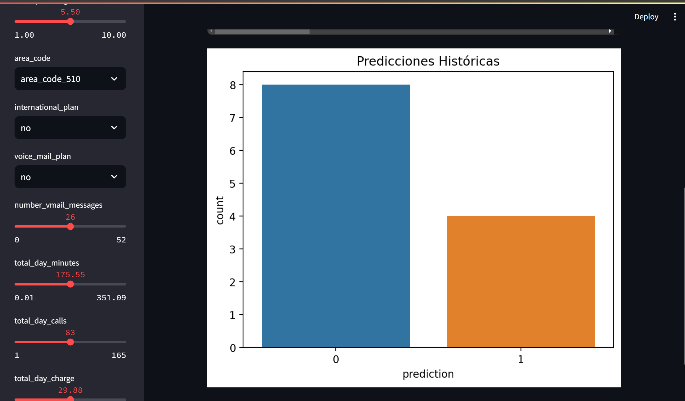

# Predict Customer Churn with Streamlit 🚀

Esta aplicación utiliza Machine Learning para predecir si un cliente va a abandonar un servicio (hacer _churn_). La aplicación está desarrollada con Python y Streamlit, permitiendo una interfaz de usuario interactiva y fácil de usar para realizar predicciones basadas en los datos proporcionados.

## Uso

#### 1. Ingresar características del cliente

Utiliza la barra lateral para ingresar los datos del cliente.

#### 2. Realizar la predicción

Haz clic en el botón "Predecir" para obtener el resultado.

#### 3. Ver resultados históricos

Revisa la sección de "Predicciones Históricas" para analizar predicciones anteriores.

## Estructura del Proyecto

`app.py`: Código principal de la aplicación Streamlit.

`utils.py`: Funciones auxiliares, incluyendo la transformación de datos.

`data/`: Contiene archivos de datos necesarios, como `schema.json` y `historical_data.csv`.

`models/`: Contiene los modelos preentrenados (`xg.pkl` y `encoder.pkl`).

`requirements.txt`: Lista de dependencias necesarias para ejecutar la aplicación.

## Contribuciones

Las contribuciones son bienvenidas. Si tienes ideas para mejorar esta aplicación, por favor abre un issue o crea un pull request.

## Licencia

Este proyecto está licenciado bajo la Licencia MIT. Ver el archivo `LICENSE` para más detalles.
